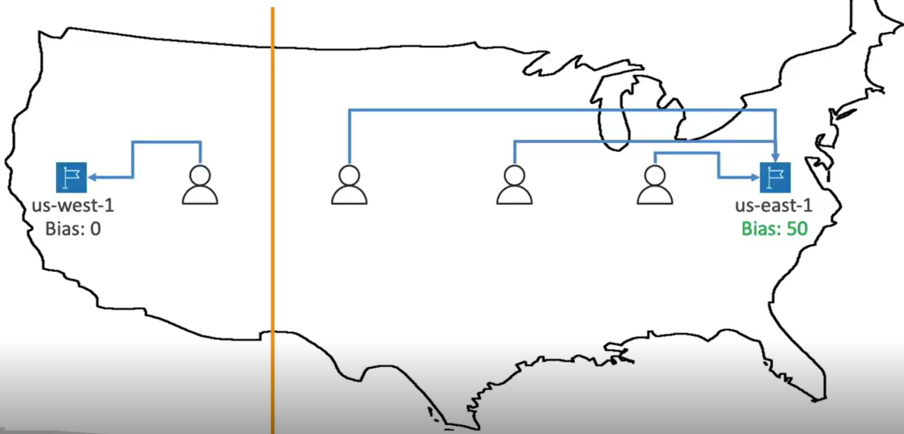

# Route 53

Route 53 is a managed DNS (Domain Name System)

### What is DNS?
DNS translated the human friendly hostnames into IP addresses.

- Use a heirarchical naming structure
- Domain Registrar - Used to register domain names (eg- AWS Route53, GoDaddy, etc.)
- Zone files - Contains all DNS records to match hotnames to IP address
- Name servers - Servers that actually resolve the DNS queries

- TLD - Top Level Domain
- SLD - Second Level Domain

### Route53 

* A highly available, scalable, fully managed and *Authoritative* DNS
    - Authoritative : the customer(you) can update the DNS records
* Route53 is also a Domain Registrar
* Ability to check the health of your resources
* The only AWS service that provides 100% availabilty SLA(Guaranteed 0 downtime)
* Why Route53? 53 is a reference to the traditional DNS port

### Route53 Records

* How you want to route the traffic for a domain
* Each record contains -
    * Domain/ Sub-domain name - eg- example.com
    * Record type - A, AAAA
    * Value - 12.13.14.15
    * Routin Policy - how Route53 responds to queries(mandatory for all DNS records except ALIAS records)
    * TTL - Amount of time the record is cached in the DNS servers
        - High TTL(eg- 24hrs): less traffic, possibliy outdated records
        - Low TTL(eg- 60sec): more traffic($$), easy to change records
* Route53 supports the following DNS records-
    * (must know) A/ AAAA/ CNAME/ NS
    * (advanced) CAA/ DS/ MX/ NAPTR/ PTR/ SOA/ TXT/ SPF/ SRV

**Record Types**

* A: URL to IPv4
* AAAA: URL to IPv6
* CNAME: URL to URL (ONLY FOR **NON** ROOT DOMAIN)
    * The target must be a domain name which must have a A or AAAA record
    * can't create top node of a DNS namespace(Zone Apex)
    * Eg- you can't create for example.com, but you can create for www.example.com
* NS: Name Servers for the Hosted Zone
* ALIAS: URL to AWS resource
    * Works for both root and non-root domains
    * An extension to DNS functionality
    * Automatically recognises changes in the resource's IP addresses
    * Can only be of type A or AAAA
    * You can't set the TTL
    * Free of charge
    * Native health check  
    * Targets - ELB, Cloudfront Distributions, API Gateway, Elastic Beanstalk, S3 Websites, VPC interface endpoints, Global Accelerator, Route53 record in the same hosted zone 
    * You can't set and Alias to EC2 DNS Name

**Hosted Zones**

A container for record that define how to route traffic to domain and its subdomains

* Public Hosted Zone: contains records that specify how to route traffic on the internet(public domain names)
* Private Hosted Zone: contains records that specify how to route traffic within one or more VPCs(private domain names)

* $0.50/month per hosted zone

### Routing Policies

* Defines how Route53 responds to DNS queries
* Route53 supports the following routing policies-
    * [Simple](#Simple)
    * [Weighted](#Weighted)
    * [Latency based](#latency-based)
    * [Failover](#failover-active-passive)
    * [Geolocation](#geolocation)
    * [Geoproximity(using Route53 Traffic Flow feature)](#geoproximity)
    * [IP-Based](#ip-based)
    * [Multivalue Answer](#multi-value)

##### Simple
* Typically routes traffic to a single resource
* Can specify multiple values in the same record 
* If multiple values are returned, a random one will be chosen by the client
* When Alias enabled, specify only one AWS resource
* Can't be associated with health checks

##### Weighted
* Control the percentage of requests that go to each resource
* Assign each record a relative weight 
    - Traffic(%) = Weight of a record / Sum of weights of all records
* DNS records must have the same name and type 
* Can be associated with health checks
* Use cases: load balancing between regions, testing new application version...
* Assign a weight of 0 to a record to stop sending traffic to a resource
* If all records have weight 0, then all records will be returned equally

##### Latency based
* Redirect to the resource that has the least latency close to us
* Super helpful when least latency is the priority for users
* Latency is based on traffic between users and AWS regions
* Can be associated with health checks(has failover capability)

##### Failover (Active Passive)
* We create a primary and a secondary resource with a Route53 mandatory health check associated with the primary resource
* In case the health check is failed by the primary resource, all the traffic will then be routed to the secondary resource
* There can only be 1 primary and 1 secondary

##### Geolocation 
* Routing based on user location
* Specify location continent, country or state(if there's overlapping, then most precise location is selected)
* Should create a 'Default' record(in case there's no match for location)
* For eg- You can set that users in Germany would be routed to a certain IP with the german version of your app, French users would be routed to a different IP with the French version of the app while all other users would be routed to a default IP with English version of the app.
* Use cases: website localisation, restrict content distribution, load balancing
* Can be associated with health checks

##### Geoproximity 
* Route traffic to your resources based on the geographic location of uses and resources
* Ability to shift more traffic to resources based on the defined bias
* To change the size of the geographic region, specify bias value:
    * expand(1 to 99) - more traffic to resource
    * shrink(-1 to -99) - less traffic to resource
* Resource can be:
    * AWS resources(specify AWS region)
    * Non-AWS resources(specify Latitude and Longitude)
* You must use Route53 Traffic Flow(advanced) to use this feature

**Traffic Flow** 
* Visual manager to manage complex routing decision trees
* Simplify the process of creating and maintaining records in large and complex configurations
* Configurations can be saved as Traffic Flow policy
* Can be applied to different Route53 hosted zones(different domain names)
* Supports versioning

##### IP-based
* Routing is based on client's IP address
* You provide a list of CIDRs for your clients and the corresponding endpoints/locations(user-IP-to-endpoint mappings)
* Use case: Optimize performance, reduce network costs...
* Eg- Route end users from a particular ISP to specific endpoint

##### Multi-value
* Use when routing resources to multiple resources
* Route53 returns multiple values/resources. The client chooses one of them
* Can be associated with health checks(return only values for healthy resources)
* Upto 8 healthy records are returned for each multi-value query
* Multi-Value is not a substitute for having an ELB

### Health check

* Only for public resources
* Health checks => Automated DNS Failover

**Types of Health checks**
1. **Health checks that monitor an endpoint**: About 15 health checkers will check the endpoint health
    * Healthy/ Unhealthy Threshold - 3(default)
    * Interval - 30sec (can set to 10s - higher cost)
    * Supports HTTP, HTTPS and TCP protocols
    * If >18% of health checkers report the endpoint is healthy, Route53 considers it Healthy.Otherwise its Unhealthy.
    * Ability to choose which locations you want Route53 to use
    * Health checks only pass when the endpoint responds with 2xx or 3xx status codes
    * Health checks can be setup to pass/fail based on the text in the first 5120 bytes of the response
    * Configure your router/firewall to allow incoming requests from health checkers

2. **Calculated Health Checks**
    * Combines the results of multiple health checks(children) into a single health check
    * Can combine using AND, OR or NOT condtions
    * Can monitor upto 256 child health checks
    * Specify how many health checks need to pass to make the parent health check pass
    * Usage: Perform maintenance of your website without causing all health checks to fail

3. **Health check - Private hosted zones**
    * Route53 health checkers are outside the VPC
    * They can't access private endpoints(private VPC or on-premise resources)
    * You create a CloudWatch metric and associate a CloudWatch Alarm, then create a health check that checks the alarm itself

### 3rd Party Registrar with AWS Route53
* You buy or register your domain with a domain registrar
* The domain registrar usually provides some DNS services to manage your DNS records
* But you can use other DNS Service to manage your DNS records
* Eg - You can purchase the domain from GoDaddy and use AWS Route53 to manage your DNS records and vice-versa

* To use Route53 with 3rd party registrar-
    - Create a public hosted zone in Route53
    - Update NS records on 3rd party websites to use Route53 Name Servers
