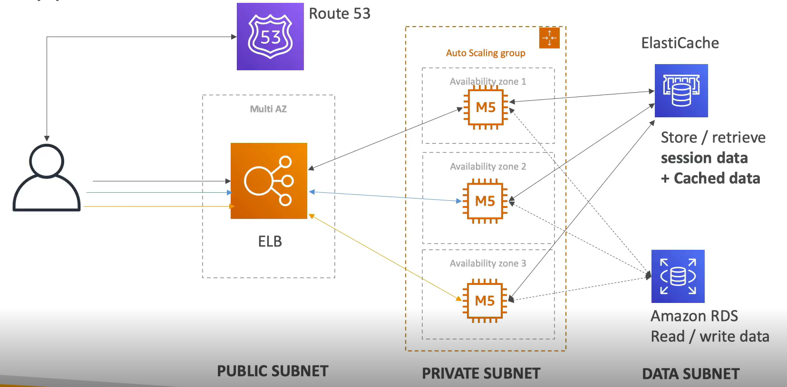
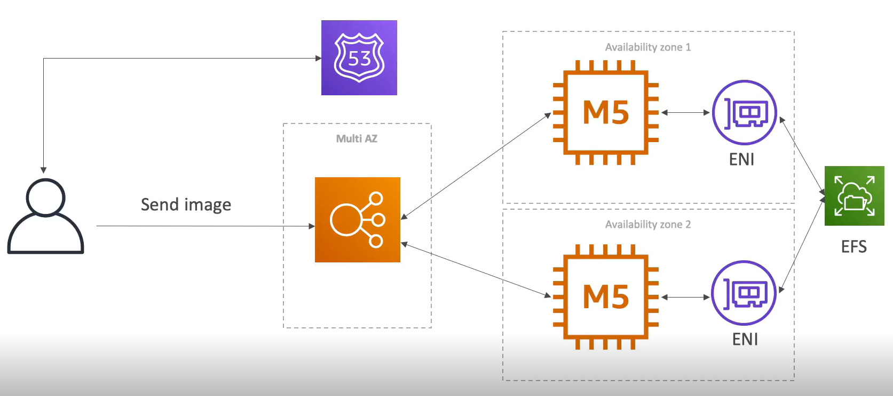
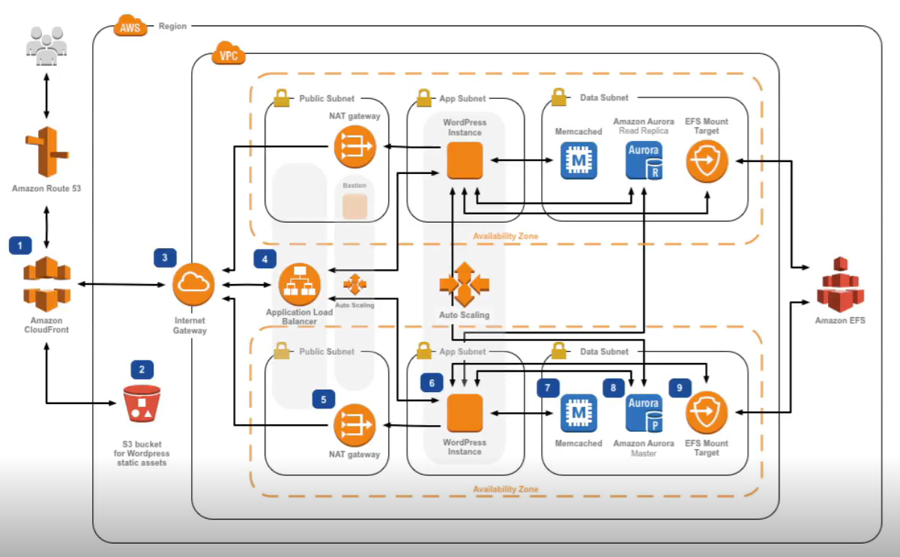

# Typical 3-tier Architecture

# LAMP Stack on EC2
* Linux: OS for EC2 instances
* Apache: Web server that runs on Linux(EC2)
* MySQL: Database on RDS
* PHP: Application Logic(running on EC2)

* Can add Redis/Memcached(Elasticache)
* Can use EBS drive to store local application data and software

# Wordpress on AWS

Diagram on AWS site-

