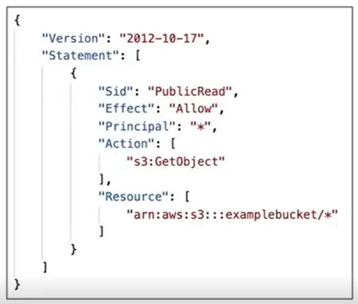

# S3 Buckets

* Amazon S3 allows people to store objects (files) in “buckets” (directories)
* It is a **regional** service
* Buckets must have a globally unique name
    * Naming convention:
        * No uppercase
        * No underscore
        * 3-63 characters long
        * Not an IP
        * Must start with lowercase letter or number
        * Must not start with prefix **xn--**
        * Must not end with suffix **-s3alias**
* Objects
    * Objects (files) have a Key. The key is the FULL path:
        * s3://my_bucket/**my_file.txt**
        * s3://my_bucket/my_folder1/another_folder/**my_file.txt**
    * The key is thus, composed of *prefix* + **object name**
        * s3://my_bucket/*my_folder1/another_folder*/**my_file.txt**
    * There’s no concept of “directories” within buckets (although the UI will trick you to think otherwise)
    * Just keys with very long names that contain slashes (“/“)
    * Object Values are the content of the body:
        * Max Size is 5TB
        * If uploading more than 5GB , must use “multipart upload”
    * Metadata (list of text key / value pairs - system or user metadata)
    * Tags (Unicode key / value pair - up to 10) - useful for security / lifecycle
    * Version ID (if versioning is enabled)
    * 3500 PUTS / 5500 GETS limit per prefix (this is why it's important to never group items with a fixed name like "user-123", "user-493", etc.)

#### AWS S3 - Versioning
* You can version your files in S3
* Enabled at the bucket level
* Same key overwrite will increment the “version”: 1, 2, 3
* It is best practice to version your buckets
    * Protects against unintended deletes (ability to restore a version)
    * Easy roll back to previous versions
* Any file that is not versioned prior to enabling versioning will have the version “null”
* Suspending versioning does not delete previous versions

#### S3 Security
* User based
    * IAM policies - which API calls should be allowed for a specific user from IAM console
* Resource based
    * Bucket policies - bucket wide rules from the S3 console - allows cross account
    * Object ACL(Access Control List) - finer grain
    * Bucket ACL - less common
* Encryption using encrytpion keys
* Block public access settings: 
    * Created to prevent company data leaks
    * If you know that your should never be public, then leave these settings on
    * Can be set at the account level
* Networking
    * Support VPC endpoints (for instances in VPC without www internet)
* Logging and Audit:
    * S3 access logs can be stored in other S3 buckets
    * API calls can be logged in AWS CloudTrail
* User Security:
* MFA (multi factor authentication) can be required in versioned buckets to delete objects
* Signed URLs: URLS that are valid only for a limited time (ex: premium video services for logged in users)

#### S3 Bucket Policies
* JSON based policies
    * Resources: buckets and objects
    * Actions: Set of API to Allow or Deny
    * Effect: Allow / Deny
    * Principal: The account or user to apply the policy to
    

* Use S3 bucket policy to:
    * Grant public access to the bucket
    * Force objects to be encrypted at upload
    * Grant access to another account (Cross Account)

#### S3 Websites
* S3 can host static website and have them accessible on the world wide web
* The website URL will be:
    * http://**bucket-name**.s3-website-**AWS-region**.amazonaws.com
    * OR
    * http://**bucket-name**.s3-website.**AWS-region**.amazonaws.com
* If you get a 403 (forbidden) error, make sure the bucket policy allows public reads!

#### S3 Replication
* Must enable versioning in source and destination buckets
* Cross-Region Replication(CRR)
* Same-Region Replication(SRR)
* Buckets can be in different AWS accounts
* Copying is asynchronous
* Must give proper IAM permissions to S3
* Use cases: 
    * CRR - compliance, lower latency access, replication across accounts 
    * SRR - log aggregation, live replication between production and test accounts
* After you enable replication, only new objects are replicated 
* Optionally, you can replicate existing object using S3 Batch Replication
    * Replicates existing objects and objects that failed replication
* For DELETE operations
    * Can replicate delete markers from source to target(optional setting)
    * Deletion with a versioning ID are not replicated( to avoid malicious deletes)
* There is no chaining of replication*
    * If bucket1 is replicated into bucket2 and bucket3 is replicated into bucket3 
    * Then objects created in bucket1 are not replicated to bucket3

#### S3 Storage Classes
* Standard - General Purpose
* Standard - Infrequent Access(IA)
* One Zone - Infrequent Access
* Glacier Instand Retrieval
* Glacier Flexible Retieval
* Glacier Deep Archive
* Intelligent Tiering

* Can move classes between manually or using S3 lifecycle configs
* Durability: How many objects are lost on avg. All storage classes have a durability of 99.999999999%.
* Availability: Measures how readily available a service is. Varies depending on storage class. Eg- S3 standard has 99.99% availability = not available for 53 minutes in a year 

##### Standard - General Purpose
* 99.99% availability
* Used for frequently accessed data
* Low latency and high throughput
* Sustain 2 concurrent facility failures
* Use Cases: Big data analytics, mobile and gaming apps, content distribution...

##### Infrequently Accessed
* For data is infrequently accessed, but requires rapid access when needed
* Lower cost than S3 standard
* Standard - Infrequent Access: 99.9% availability
    * use cases: disaster recovery and backups
* One Zone Infrequent access: In a single AZ. Data is lost when AZ is destroyed.
    * 99.5% availability
    * Use cases: Storing secondry backups of on-premise data or data you can recreate

##### Glacier
* Lost cost object storage meant for archiving/backup
* Pricing: price for storage + object retrieval
* Glacier Instant Retrieval: Milisecond retrieval, great for data accessed once a quarter
    * Min storage duration - 90days
* Glacier Flexible Retrieval: Expedited(1-5mins), Standard(3-5hours), Bulk(5-12hours)- free
    * Min storage duration - 90days
* Glacier Deep Archive: For long term storage
    * Standard(12hours), Bulk(48hours)
    * Min storage duration - 180days

##### Ingelligent Tiering
* Small monthly monitoring and auto-tiering fee
* Moves objects automatically between access tiers based on usage 
* No retrieval charges
* **Frequent Access Tier(automatic):** default tier
* **Infrequent Access Tier(automatic):** objects not accessed for 30 days
* **Archive Instant Access Tier(automatic):** objects not accessed for 90 days
* **Archive Access Tier(optional):** configurable from 90 days to 700+ days
* **Deep Archive Access Tiers(optional):** configurable from 180 days to 700+ days

