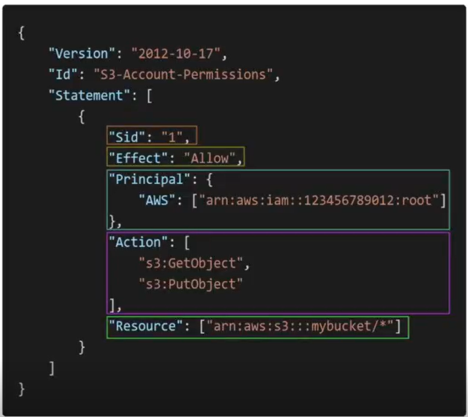

# IAM (Identity and Access Management)

When using AWS the root account should never be used. Each physical user must be allotted an IAM user with proper permissions. 

- Global service
- Users : A physical person. Users can belong to multiple groups.
- Groups : Can only contain users and not other groups.
- Policies : JSON docs defining what actions are allowed or restricted. Assigned to a user or a group. 
- IAM roles: Permissions assigned to AWS services to perform actions on other other services, eg.- access data from S3 bucket, etc.

## IAM Policy

- JSON docs defining what actions are allowed or restricted. Assigned to a user or a group. 
- When assigning policies follow the least priviledge principle ie. don't give more permissions than a user needs.

### Policy structure.

- Version : Policy language version. Always include "2012-10-17" 
- Id: Identifier for the policy (optional)
- Statement: One or more individual statements (required)
    - Sid: Identifier for the statement. (OPTIONAL)
    - Effect: 'Allow' or 'Deny' access.
    - Principal: account/user/role to which the policy is applied to.
    - Action: List of actions the policy the allows or denies.
    - Resource: List of resources to which the actions are applied to.
    - Condition: Condition for this policy comes in effect. (OPTIONAL).

## IAM Security tools

- IAM Credential report (account level): Lists all your account users and the status of their various actions.
- IAM Access Advisor (user level): Shows the service permissions granted to a user and when those services were last accessed.
Can use this info revise your policies. 

## Security Best Practices

1. Password policy: For eg: The password must be a certain length and must contain certain special characters. Password must be changed every 90 days. etc...

2. MFA (Multi-Factor Authentication): Password + an MFA device.
    MFA devices options-
    - Virtual MFA devices: Support for muliple tokens on a single device.Eg- Google Authenticator(Phone), Authy(mutli-device).
    - Universal 2nd Factor(U2F) Security key: A physical device like a pd. Eg- Yubikey by Yubico(3rd party). Supports multiple roots and IAM users.
    - Hardware Key fob: Eg- Provided by Gemalto(3rd Party)
    - Hardware Key fob for AWS GovCloud(USA): Provided by SurePassID(3rd Party)

## Access AWS

- 3 Options: 
    - AWS Management Console: Password + MFA
    - AWS Command Line Interface(CLI): A tool that enables you to access AWS through terminal.   
      Protected by access keys.
      Direct access to all public APIs of AWS services.  
      **CloudShell** : CLI on the cloud. No need to download on you machine.
    Open source. 
    - AWS Software Development Kit(SDK): Access AWS Through code.  
      Protected by Access keys.   
      Language specific.

- Access keys are granted through AWS Console.
- Access Key Id ~= Username
  Secret Access Key ~= Password

## Best Practices

- Don't use root account except for the initial setup.
- One physical user = one IAM user.
- Assign users to groups and assign permissions to groups. 
- Assign the least amount of permissions needed.
- Create a strong password policy and enforce MFA.
- Never share IAM users and access keys.