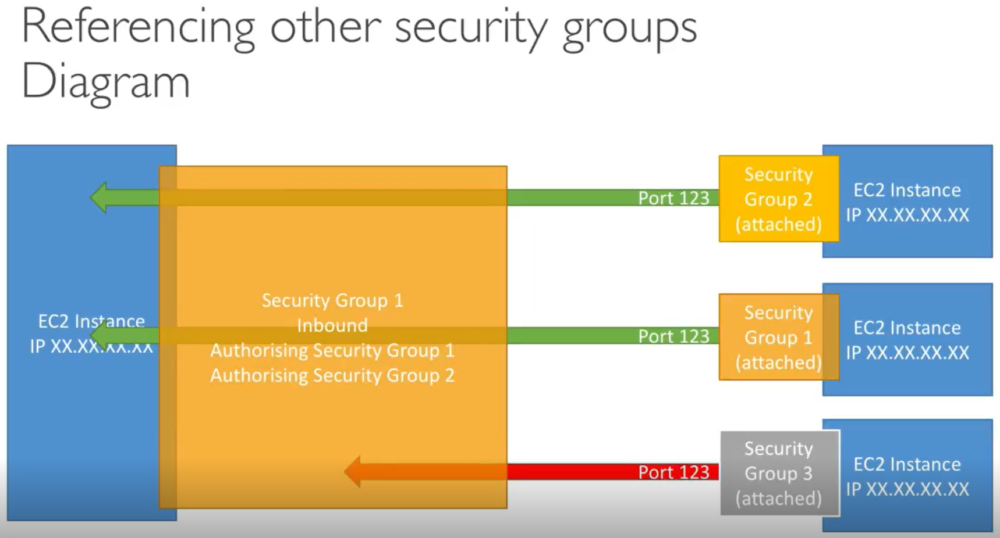

# Security Groups

#### The fundamental of network security in AWS

* Only contain allow rules
* Security group rules can refernce by IP or by security group
* Can be attached to multiple instances
* Locked down to a region / VPC combination
* Does live “outside” the EC2 - if traffic is blocked, the EC2 instance won’t see it
* It’s good to maintain one separate security group for SSH access
* If your application is not accessible (time out), then it’s usually a security group issue
* If your application gives a “connection refused” error, then it’s an application error or its not launched
* All inbound traffic is blocked by default
* All outbound traffic is authorized by default

#### Security groups act as a firewall on EC2 Instances
They regulate:
* Access to ports
* Authorized IP ranges - IPv4 and IPv6
* Control of inbound network
* Control of outbound network

## Classic Ports to know

* 22 = SSH(Secure Shell) - log into linux instance
* 21 = FTP(File Transfer Protocol) - Upload file into a file share
* 22 = SFTP(Secure File Transfer Protocol) - Upload file using SSH
* 80 = HTTP - Access unsecured websites
* 443 = HTTPS - Access secure webbsites
* 3389 = RDP(Remote Desktop Protocol) - log into Windows instance