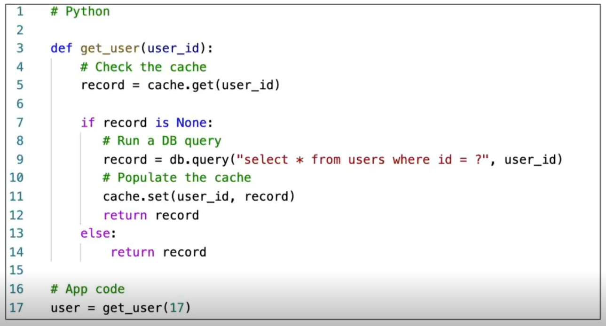
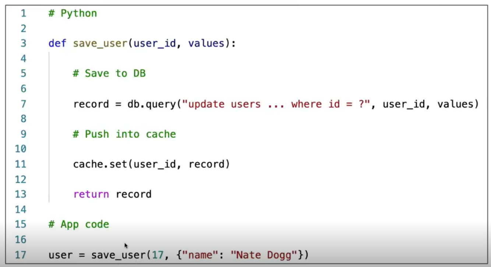

# ElastiCache

Overview:
The same way RDS is to get managed Relational Databases, ElastiCache is to get managed Redis or Memcached. Caches are in-memory databases with really high performance, low latency. They help reduce loads off of databases for read intensive workloads. They help make your application stateless. 

* AWS takes care of OS maintenance / patching, optimizations, setup, configuration, monitoring, failure recovery and backups
* Implementing ElastiCache involves heavy application code changes

#### Solution Architecture - DB Cache
* Application queries ElastiCache, if not available, get from RDS and store in ElastiCache
* Helps relieve load in RDS
* Cache must have an invalidation strategy to make sure only the most current data is used in there
User Session Store
* User logs into any of the applications
* The application writes the session data into ElastiCache
* The user hits another instance of our application
* The instance retrieves the data and the user is already logged in

#### Redis Overview
* Redis is an in-memory key-value store
* Super low latency (sub ms)
* Cache survive reboots by default (it’s called persistence)
* Great to host
    * User sessions
    * Leaderboards (for gaming)
    * Distributed states
    * Relieve pressure on databases (such as RDS)
    * Pub / Sub capability for messaging 
* Multi AZ with Automatic failover for Disaster Recovery if you don’t want to lose your cache data
* Support for Read Replicas

#### Memcached Overview
* Memcached is an in-memory object store
* Multi-node for partitioning of data (sharding)
* Multithreading architecture
* Cache doesn’t survive reboots
* Use cases:
* Quick retrieval of objects from memory
* Cache often accessed objects
* Overall, Redis has largely grown in popularity and has better feature sets than memcached
* Most likely, you’d probably only want to use Redis for caching needs

#### Caching Implementation
- Lazy Loading / Cache-Aside / Lazy Population
	- Pros
		- Only requested data is cached (the cache isn’t filled up with unused data)
		- Node failures are not fatal (just increased latency to warm the cache)
	- Cons
		- Cache miss penalty that results in 3 round trips, noticeable delay for that request
		- Stale data: data can be updated in the database and outdated in the cache

    - Python pseudocode to identify lazy loading
    
		
- Write Through – Add or Update cache when database is updated
	- Pros:
		- Data in cache is never stale, reads are quick
		- Write penalty vs Read penalty (each write requires 2 calls)
	- Cons:
		- Missing Data until it is added / updated in the DB. Mitigation is to implement Lazy Loading strategy as well
		- Cache churn – a lot of the data will never be read

    - Python pseudocode to identify write-through 
    
		
#### Cache Evictions and Time-to-live (TTL)
- Cache eviction can occur in three ways: 
	- You delete the item explicitly in the cache
	- Item is evicted because the memory is full, and it’s not recently used (LRU) 
	- You set an item time-to-live (TTL)
- TTL are helpful for any kind of data: 
	- Leaderboards
	- Comments
	- Activity streams
- TTL can range from few seconds to hours or days
- If too many evictions happen due to memory, you should scale up or out

#### Amazon Memory DB for Redis vs Elasticache
- Redis comaptible, durable, in-memory database service
- Ultra-fast performance( > 160 million requests/s)
- Multi-AZ transactional log
- Scales seamlessly from 10s of Gbs to 100s of TBs of storage
- Use cases : web and mobile apps, online gaming, media streaming, etc.

#### When to cache
Points to keep in mind- 
- **Is it safe to cache?** Data may be out of date, eventually consistent
- **is cacheing effective for that data?**
    - Pattern : data changing slowly, few keys are frequently used
    - Anti pattern : data changing frequently, all large key space is frequently needed
- **Is data structured well?** Eg- Key-value pairs, cacheing aggregation results
- **Only cache the data that makes sense**(eg.- user profiles, blogs, etc.)
- **Implement TTL for cache invalidation**
      
*There are only two hard things in Computer Science: cache invalidation and naming things.*
*-- Phil Karlton*